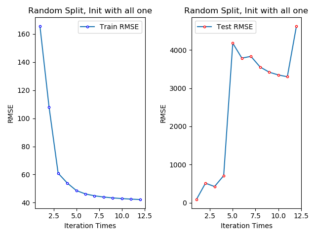
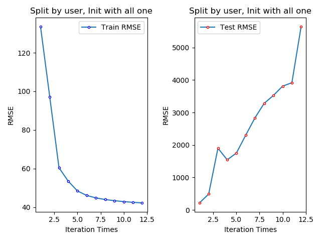
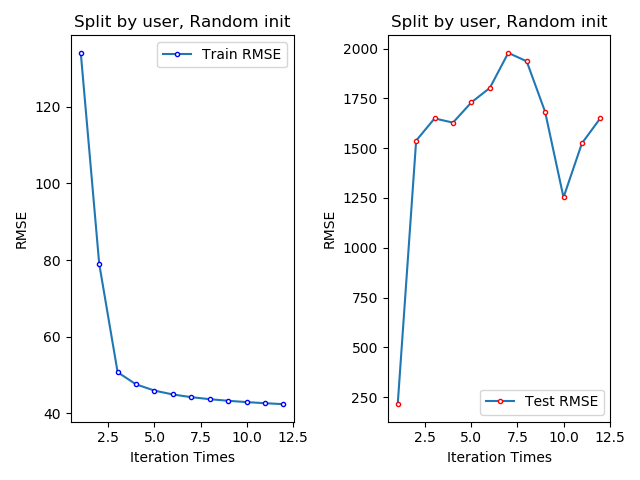
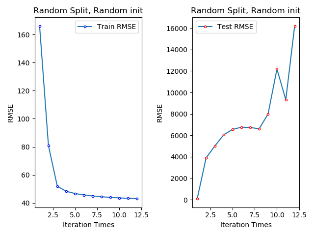
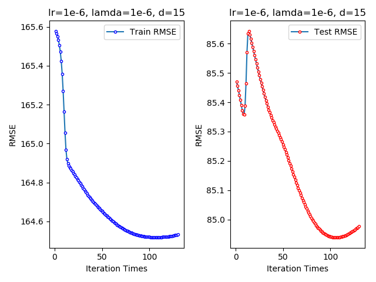
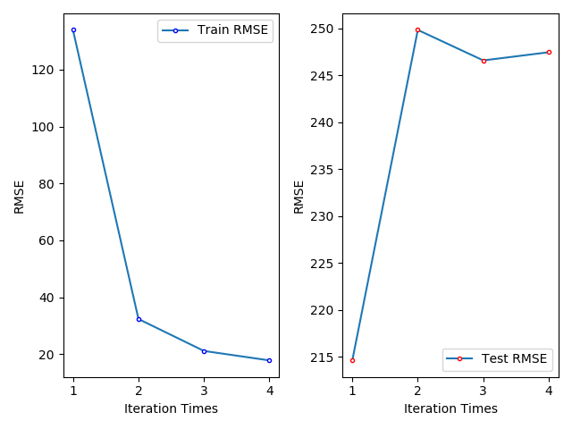
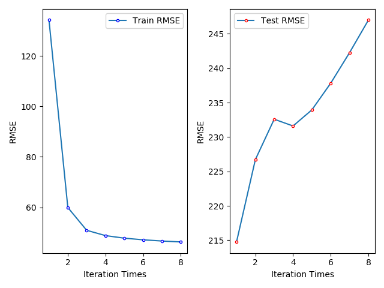

# 基于模型的协同过滤算法的实现

- 1160300302 王丙昊
- 1160300314 朱明彦

## 基本要求

- 基于UV分解，建立协同过滤模型（矩阵分解的代码要自己编写）
- 在user_artist_data中，预留20%的数据，作为验证集
- 计算模型对验证集进行预测的结果的RMSE

## 数据集

数据集路径均为"`./*.txt`"

- `user_artist_data.txt`：2420万条用户播放艺术家歌曲次数
- `artist_data.txt`: 160+万个艺术家的ID和名字
- `artist_alias.txt`: 拼写错误的艺术家ID（变体）到该艺术家的规范ID的映射关系（19万条记录）

## 数据处理部分

相关的处理步骤见`./Data-Preprocessing.ipynb`, 此处仅仅说明一些处理的结果.

`./user_artist_data.txt`中包含2400余万条数据, 其正确的格式应该为`用户id 艺术家id 次数`.
可以使用shell脚本对数据进行处理, 主要利用`grep`命令来做. 经过判断可以发现全部的数据均符合要求.
**对于其余两个源数据文件也进行类似的处理, 此处不进行赘述**

对于已经得到格式正确的数据, 需要进行下面几个步骤的处理

1. 由于`./user_artist_data.txt`中存在部分错误的艺术家id, 所以首先利用`./artist_correct_format_alias.txt`中正确的艺术家id来进行替换
2. 得到正确处理过的M矩阵, 根据统计其中的最大/最小用户id和艺术家id, 发现其不是连续的, 而在U,V矩阵中如果能够利用连续的下标可以使得存储空间得到一定的节省, 所以利用python中的字典对数据建立id和下标的映射.
3. 每个id映射为下标后, 重新输出到文件中, 保存在`./out.txt`.

## 数据划分

主要利用了两种不同的方式, 进行数据划分, 划分数据为20%的测试数据, 剩余80%为训练数据.

1. 生成0-1之间的随机数, 当生成随机数小于0.2时, 将对应的数据划分到测试集, 否则划分到训练数据.
2. 由于第一种方式不能够保证每一个用户均出现在训练数据中(在我们随机进行的一次测试中, 这种性质得到的偶然得到了保证), 所以采取了对于每一个用户都随机选取其听歌数据的20%作为测试集.

使用第一种划分得到的训练和测试集保存在`./train.txt, test.txt`. 第二种的划分结果保存在`./train-split-user.txt, test-split-user.txt`.
划分的具体实现为`./split.py`.

## 矩阵分解部分

主要有以下几种不同的实现方式

1. 使用python实现PPT上公式所表示的矩阵分解
2. 使用C++实现PPT上公式所示的矩阵分解
3. 使用python实现基于GD的ALS
4. 使用C++实现基于GD的ALS
5. 使用python实现含有正则系数的ALS

### 关于第一种实现方式

首先基于这个方式的矩阵分解是最早实现的，但是由于其固有的复杂度过高和没有用到numpy等一些矩阵运算的加速工具，
导致每一轮的实际运行时间过长，所以没有实际运行的结果保留。

更新U矩阵中第r行,第s列位置的公式为:
$$
x=\frac{\sum_{j} v_{s j}\left(m_{r j}-\sum_{k \neq s} u_{r k} v_{k j}\right)}{\sum_{j} v_{s j}^{2}}
$$
更新V矩阵中第r行,第s列位置的公式为:
$$
y=\frac{\sum_{i} u_{i r}\left(m_{i s}-\sum_{k \neq r} u_{i k} v_{k s}\right)}{\sum_{i} u_{i r}^{2}}
$$

我们通过上面的公式,在U矩阵和V矩阵中交替地更新其中的元素,每当U和V矩阵全部更新完一次之后,计算此时训练集上的RMSE,
当迭代达到一定轮数或者两轮迭代RMSE的差值的绝对值小于某个阈值时,停止迭代.

源文件为`Lab-1.py`，主要函数为`UV_composition`，其用于矩阵分解的计算。

### 关于第二种方式

这种方式相比第一种方式，其主要的不同在于实现细节，我们使用C++代替了python, 并且增加了一个空间中的索引，用于记录两种信息：
该行有多少元素以及该列有多少元素。

具体的实现示例，`map<int, map<int, int> > M`, 我们存储了两个这样的数据结构:

第一个`map<int, map<int, int> >`中, 外层map的key位置存储的是矩阵中元素的行, 内层map的key位置存储的是矩阵中元素的列,
内层map的value位置存储的是矩阵中对应位置的元素值;

第二个`map<int, map<int, int> >`中, 外层map的key位置存储的是矩阵中元素的列, 内层map的key位置存储的是矩阵中元素的行,
内层map的value位置存储的是矩阵中对应位置的元素值;

其实仅存储一个这样的`map<int, map<int, int> >`便可以实现所需要的功能, 存储两个其实是出于用空间换时间这样一个目的:
更新U和V矩阵时, 我们需要代入第一种方式中提到的公式, 其中更新U矩阵中元素时, 我们需要在训练数据"矩阵"M中寻找某一行,
而更新V矩阵中元素时, 我们需要在"矩阵"中寻找某一列, 所以我们采用了存储两个这样的 `map<int, map<int, int> >`, 来加速
更新U和V矩阵时对训练数据的查找过程.

**源文件为`als.cpp`。**
使用这种方式，对于训练集数据保持预期的结果，当调整参数d时，随着d的增大，对于矩阵M的拟合变好，
整体的RMSE下降；但对于测试数据，无论d取值如何，其RMSE都随着迭代的轮数而增大。

由于实验期间曾询问老师关于以上情况的问题，曾怀疑与训练集、测试集数据划分相关，改变了数据集划分
的方式之后，这种状况仍然没有改变。

以下是四种不同的情况下，使用`d=15`进行测试的结果，可以看到在训练数据上RMSE可以稳定下降，
但是在测试数据集上却始终呈现上升趋势。这种情况在改变`d`时仍然没有改变。

### 关于第三种、第四种方式

这两种实现没有本质的区别，细节上也几乎相同，但由于“C++语言速度更快”的原因，在测试时选择了这种
实现方式进行。源文件为服务器上的`/UnderG/zhumingyan/DM/main.cpp`。

关于GD算法原理:

首先定义损失函数，这里使用训练数据矩阵M与重新构建的`UV`矩阵之间误差的平方作为损失函数：

$$e_{i j}^{2}=\left(r_{i j}-\hat{r}_{i j}\right)^{2}=\left(r_{i j}-\sum_{k=1}^{K} p_{i k} q_{k j}\right)$$

最终我们需要求解所有的非0项的损失函数之和的最小值：

$$
\min \operatorname{loss}=\sum_{r_{i j} \neq 0} e_{i j}^{2}
$$

对该损失函数的求解：对于上述的平方损失函数，我们通过梯度下降法求解，梯度下降法的核心步骤为：

1. 求解损失函数的负梯度：

$$
\begin{array}{l}{\frac{\partial}{\partial p_{i k}} e_{i j}^{2}=-2\left(r_{i j}-\sum_{k=1}^{K} p_{i k} q_{k j}\right) q_{k j}=-2 e_{i j} q_{k j}} \\ {\frac{\partial}{\partial q_{i k}} e_{i j}^{2}=-2\left(r_{i j}-\sum_{k=1}^{K} p_{i k} q_{k j}\right) p_{i k}=-2 e_{i j} p_{i k}^{j}}\end{array}
$$

2. 根据负梯度的方向更新变量：
  
$$
\begin{array}{l}{p_{i k}^{\prime}=p_{i k}-\alpha \frac{\partial}{\partial p_{i k}} e_{i j}^{2}-lamda*p_{i k}=p_{i k}+2 e_{i j} q_{k j}}-lamda*p_{i k} \\ {q_{k j}^{\prime}=q_{k j}-\alpha \frac{\partial}{\partial q_{k j}} e_{i j}^{2}-lamda*q_{k j}=q_{k j}+2 e_{i j} p_{i k}}-landa*q_{k j}\end{array}
$$

在实现时, 采用了和ALS相似的方式, 只不过是在每轮迭代更新U和V矩阵时, 有两点不同的地方:

1. 在ALS中, 我们是根据U和V矩阵中的元素去训练数据中找某一行或某一列; 而在GD中, 我们是根据某条训练样本, 去寻找U矩阵中的一行以及V矩阵中的一列.
2. 第二点区别在于更新U和V矩阵时使用的公式不同.

在测试的时候，由于GD这种方式引入了更多的超参数，包括学习率(learning rate, lr)，正则项系数($\lambda$)，
所以需要更多的测试来观察实验结果。

学习率的大小会影响error的计算，进而影响U、V矩阵中的值，由于double数据的存储限制，lr的取值为1e-6，
当盲目调大lr时会导致double类型的上溢出。

整体的测试结果为，在训练集上RMSE始终呈现下降趋势，在测试集数据上RMSE则下降极慢，甚至会出现偶尔的波动上升情况。
如下图所示，其中横轴表示迭代的轮数，纵轴表示RMSE。

### 关于第五种方式

参考[斯坦福大学2015春季cme323课程的第14次笔记][lec14]的基本实现。

相比第一和第二种方式中使用的矩阵元素更新公式，这里每次更新U矩阵的某一行，以及V矩阵的某一列，在时间复杂度上有了明显的下降，使用python编写，在合理的时间内可以迭代出结果。

算法原理如下：

在每一轮迭代过程中，U矩阵的某一行按下面的公式来更新：

$$x_{u}=\left(\sum_{r_{\text {uit} \in r_{u *}}} y_{i} y_{i}^{\top}+\lambda I_{k}\right)^{-1} \sum_{r_{\text {ui} \in r_{u *}}} r_{u i} y_{i}$$

V矩阵的某一行按下面的公式来更新：
$$
y_{i}=\left(\sum_{r_{u i} \in r_{* i}} x_{u} x_{u}^{\top}+\lambda I_{k}\right)^{-1} \sum_{r_{u i} \in r_{* i}} r_{u i} x_{u}
$$

但是结果不好,在测试集没有明显的下降，整体处在上升趋势。如下面2张图所示，其中上面一张图为`d=100`
时的测试结果，下面一张图为`d=10`时的测试结果，由于在`d`较大的时候运算时间过长，所以只有迭代4轮的数据。

[ lec14 ]: http://stanford.edu/~rezab/classes/cme323/S15/notes/lec14.pdf
[ fastals ]: https://web.stanford.edu/~rezab/papers/fastals.pdf

## 源文件介绍

- `./PPT-example.txt` : PPT上5x5的例子, 数据格式为`i,j,v`。
- `./als.cpp` : 使用ALS算法，主要参考PPT上给出的实现。
- `./gd.cpp` : 使用梯度下降法。
- `./stanford.py` : 参考[斯坦福大学2015春季cme323课程的第14次笔记][lec14]的基本实现。
- `./Data-Preprocessing.ipynb` : 数据预处理。

## 参考文献

- [https://web.stanford.edu/~rezab/papers/fastals.pdf][ fastals ]
- [http://stanford.edu/~rezab/classes/cme323/S15/notes/lec14.pdf][ lec14 ]
